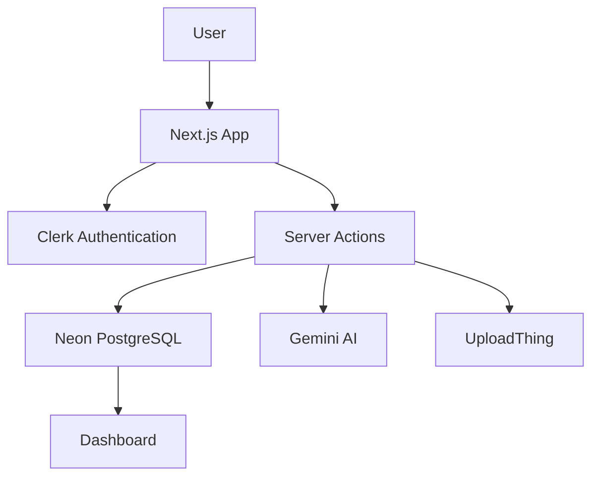

<div align="center">


### 🚘 Intelligent Vehicle Management Platform Powered by AI

<p>
VehicleOS is a modern full-stack platform that helps vehicle owners manage maintenance, fuel expenses,
documents, reminders, and AI-powered vehicle diagnostics—all from one beautiful dashboard.
</p>

<br/>

<a href="https://vehicle-os.vercel.app/">
  
</a>

<a href="https://github.com/alieshpatel/VehicleOS">
  
</a>

<br/><br/>


</div>

---

# 🌟 About VehicleOS

VehicleOS is an AI-powered SaaS platform for vehicle owners to organize every aspect of vehicle ownership.

### Core capabilities

- 🚗 Vehicle Management
- 🔧 Maintenance Records
- ⛽ Fuel Tracking
- 📊 Analytics Dashboard
- 📂 Digital Document Vault
- 🔔 Smart Reminders
- 🤖 Gemini AI Vehicle Diagnosis
- 🔐 Secure Authentication

---

# ✨ Core Features

| Feature | Description |
|---|---|
| 🚗 Vehicle Management | Manage multiple vehicles in one account |
| 🔧 Maintenance Tracker | Complete service history |
| ⛽ Fuel Logs | Mileage & fuel analytics |
| 📂 Document Vault | RC, Insurance, PUC & Bills |
| 🔔 Smart Reminders | Upcoming service & expiry alerts |
| 🤖 AI Diagnosis | Gemini-powered vehicle troubleshooting |
| 📊 Dashboard | Realtime statistics & charts |
| 🔒 Authentication | Clerk Email + Google Sign-In |

---

# 🖥️ Modern UI/UX

- ✅ Responsive Design
- ✅ Mobile Friendly
- ✅ Light/Dark Mode Ready
- ✅ Clean SaaS Dashboard
- ✅ Fast Navigation
- ✅ Accessible Components
- ✅ Beautiful Charts

---

# 🛠 Tech Stack

| Layer | Technology |
|---|---|
| Frontend | Next.js 15, React 19, TypeScript |
| Styling | Tailwind CSS v4, ShadCN UI |
| Backend | Next.js Route Handlers & Server Actions |
| Database | Neon PostgreSQL |
| ORM | Drizzle ORM |
| Authentication | Clerk |
| File Storage | UploadThing |
| AI | Google Gemini |
| Charts | Recharts |
| Deployment | Vercel |

---

# ⚙️ System Architecture



---

# 📂 Folder Structure

```text
VehicleOS/
├── src/
│   ├── app/
│   ├── actions/
│   ├── components/
│   ├── db/
│   │   ├── index.ts
│   │   └── schema/
│   ├── lib/
│   ├── hooks/
│   └── types/
├── drizzle/
├── public/
├── middleware.ts
├── drizzle.config.ts
└── package.json
```

---

# ⚡ Installation

```bash
git clone https://github.com/alieshpatel/VehicleOS.git
cd VehicleOS
yarn install
```

Run development server

```bash
yarn dev
```

---

# 🔑 Environment Variables

```env
DATABASE_URL=
NEXT_PUBLIC_CLERK_PUBLISHABLE_KEY=
CLERK_SECRET_KEY=
CLERK_WEBHOOK_SECRET=
UPLOADTHING_TOKEN=
GEMINI_API_KEY=
```

---

# 🗄 Database Setup

Generate schema

```bash
yarn drizzle-kit generate
```

Push schema

```bash
yarn drizzle-kit push
```

Studio

```bash
yarn drizzle-kit studio
```

---

# 🤖 AI Diagnosis Flow

```text
Vehicle Symptoms
        │
        ▼
 Gemini Prompt
        │
        ▼
 JSON Response
        │
        ▼
 Possible Causes
     Urgency
  Estimated Cost
  Recommendation
        │
        ▼
Save Report to Database
```

---

# 📊 Dashboard

- Vehicle Count
- Fuel Expenses
- Upcoming Services
- Active Reminders
- Monthly Analytics
- Maintenance Cost Chart
- Fuel Trend Chart
---

# 🎯 Use Cases

- Personal Vehicle Management
- Family Vehicle Tracking
- Garage Service History
- Fuel Expense Monitoring
- Insurance & PUC Renewal
- AI Troubleshooting

---

# 📈 Project Highlights

| Feature | Status |
|---|---|
| Authentication | ✅ |
| CRUD | ✅ |
| Drizzle ORM | ✅ |
| Neon PostgreSQL | ✅ |
| UploadThing | ✅ |
| Gemini AI | ✅ |
| Charts | ✅ |
| Responsive UI | ✅ |

---

# 🤝 Contributing

```text
Fork Repository
Create Branch
Commit Changes
Push Branch
Open Pull Request
```

---

# 👨‍💻 Developer

## Aliesh Patel

Full Stack Developer
- MERN & Next.js Developer

---

# ⭐ Support

If you like this project:

- ⭐ Star the repository
- 🍴 Fork it
- 📢 Share it

---

<div align="center">

## 🚗 VehicleOS

**Drive Smarter. Maintain Better. Powered by AI.**

Made with ❤️ by **Aliesh Patel**

</div>
